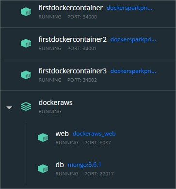

## TALLER DE DE MODULARIZACIÓN CON VIRTUALIZACIÓN E INTRODUCCIÓN A DOCKER Y A AWS
### Miguel Ángel Rodríguez Siachoque
### 30 de Septiembre de 2021

### Descripción
El taller consiste en crear una aplicación web pequeña usando el micro-framework de Spark java (http://sparkjava.com/). Una vez tengamos esta aplicación procederemos a construir un container para docker para la aplicación y los desplegaremos y configuraremos en nuestra máquina local. Luego, cerremos un repositorio en DockerHub y subiremos la imagen al repositorio. Finalmente, crearemos una máquina virtual de en AWS, instalaremos Docker , y desplegaremos el contenedor que acabamos de crear.

### Descripción de la aplicación
- El servicio MongoDB es una instancia de MongoDB corriendo en un container de docker en una máquina virtual de EC2.
- LogService es un servicio REST que recibe una cadena, la almacena en la base de datos y responde en un objeto JSON con las 10 ultimas cadenas almacenadas en la base de datos y la fecha en que fueron almacenadas.
- La aplicación web APP-LB-RoundRobin está compuesta por un cliente web y al menos un servicio REST. El cliente web tiene un campo y un botón y cada vez que el usuario envía un mensaje, este se lo envía al servicio REST y actualiza la pantalla con la información que este le regresa en formato JSON. El servicio REST recibe la cadena e implementa un algoritmo de balanceo de cargas de Round Robin, delegando el procesamiento del mensaje y el retorno de la respuesta a cada una de las tres instancias del servicio LogService.
 

### Requisitos :
> - Java 1.8
> - Maven 
> - Spark
> - MongoDB
> - Dockers
> - AWS

#### Packages:
 
La arquitectura de este taller se divide en 3 partes fundamentales, para generar un proceso optimo con la interacción de servidor-usario y usario-servidor.
#### Package: DiagramaPrincipal - SparkWebServer.java
 
Este es la parte principal, ya que se conectara de manera adecuada con la base de datos y la interacción de los archivos .Json que contienen la información suministrada, también se puede observar la ejecución del servidor SparkWeb con el cual se mantienen los datos en funcionamiento.
#### Package: Diagrama Data Base - ConnectionDB.java
 
Esta parte se encargara de generar la conexión del servidor con la base de datos, también del mantenimiento de esta por la modificaciónes que tendra por la interacción realizada. Por otro lado la base de datos contiene colecciones y para su versión cliente.
#### Package: Diagrama Json - ConnectionJson.java
 
Esta parte se encargara de generar los archivos .Json para que la base de datos pueda atender los datos proporcionados por los usuarios, de manera ordena con su respectiva identificación, contexto y hora de ingreso. Esto complementa la documentación e iteración del los datos proporcionados.

### Ejecución comando:
[Ejecución - Dockers & AWS](EjecucionTaller.pdf)

### Pruebas de realización
 
Funcionamiento de Docker local. 
 
Funcionamiento de Docker local del profesor en el puerto 1. 
 
Funcionamiento de Docker local del profesor en el puerto 2. 
 
Funcionamiento de Docker local del profesor en el puerto 3. 
 
Dashboard de los dockers manejados. 
 
Imagenes Dockers. 
 
Bases de datos mongo en Dockers. 
 
Funcionamiento del Doker utilizado para la maquina virtual AWS. 
 
Insertación de las imagenes en la maquina virtual de AWS para el posterior funcionamiento. 
 
Instancia de la maquina virtual de AWS. 
 
Funcionamiento de la maquina virtual insertada con Hello Docker!. 
 
Pagina principal de registro de cadenas de usuarios. 
 
Cadenas ingresadas por los usuarios. 
 
Cadenas ingresadas por los usuarios en MongoDB. 

## JavaDoc:
[JavaDoc - Dockers & AWS](JavaDocs/index.html)